# Movie Booking

A MERN movie ticket booking application with theatre and screen management, seat reservations, Razorpay checkout, Google sign-in, and booking confirmation emails.

## Features

### Customers

- Browse movies and descriptions, theatres, screens, and daily schedules.
- Register and log in with a username/password or Google.
- Select up to 10 seats and reserve them during checkout.
- Pay through Razorpay and receive a confirmation email.
- Cancel an unconfirmed booking to release its seat hold.
- View purchased tickets, with upcoming shows first and expired tickets styled separately.

### Administrators

- Create, edit, and delete movies, including descriptions, posters, and duration.
- Manage theatres and screen seating layouts.
- Create showtimes with ticket prices, daily repetition, and release controls.
- Optionally prepare the next showtime using movie duration, a gap, and rounding.
- View schedules by screen and time, search showtimes, and inspect booked seats.
- Manage users and assign admin roles.

## Quick Tour

<h3 align="center">Home</h3>

<p align="center">
  
</p>

<h3 align="center">Register and Login</h3>

<p align="center">
  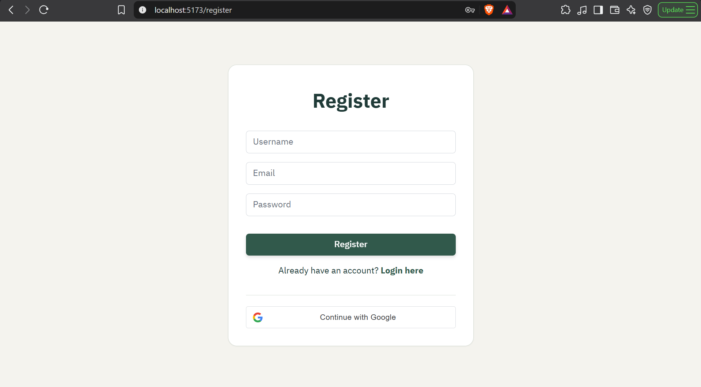
</p>

<p align="center">
  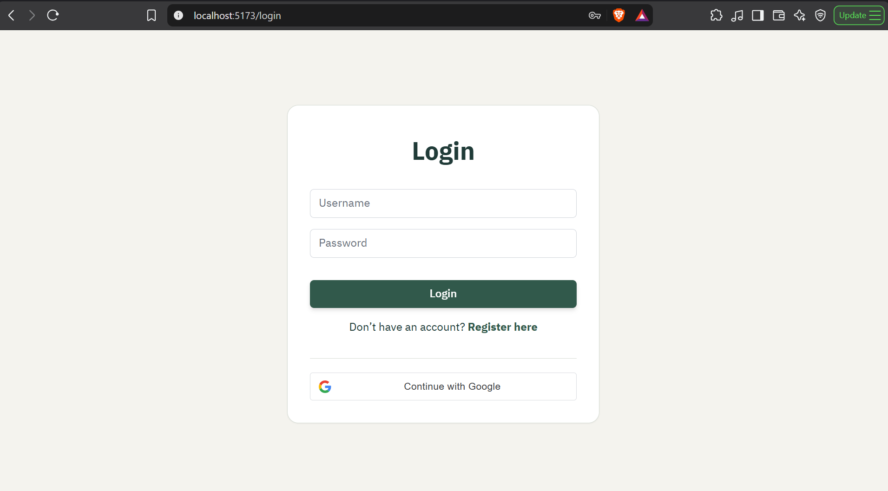
</p>

<h3 align="center">Theatres and Screens</h3>

<p align="center">
  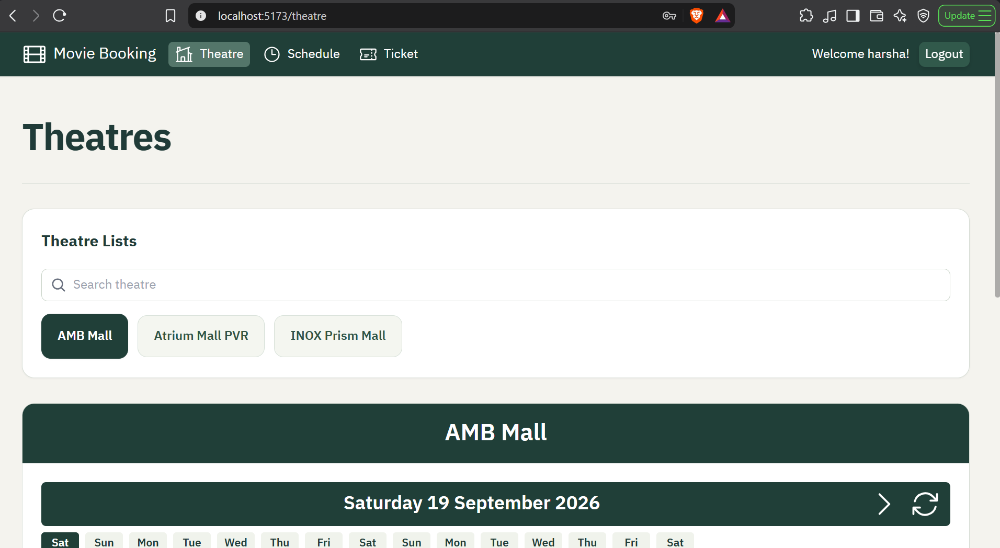
</p>

<p align="center">
  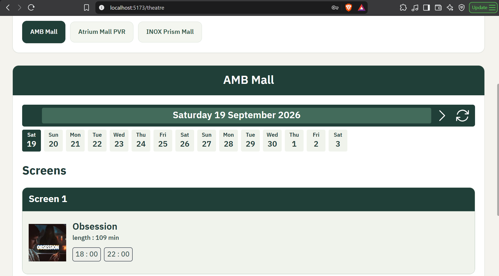
</p>

<h3 align="center">Schedule</h3>

<p align="center">
  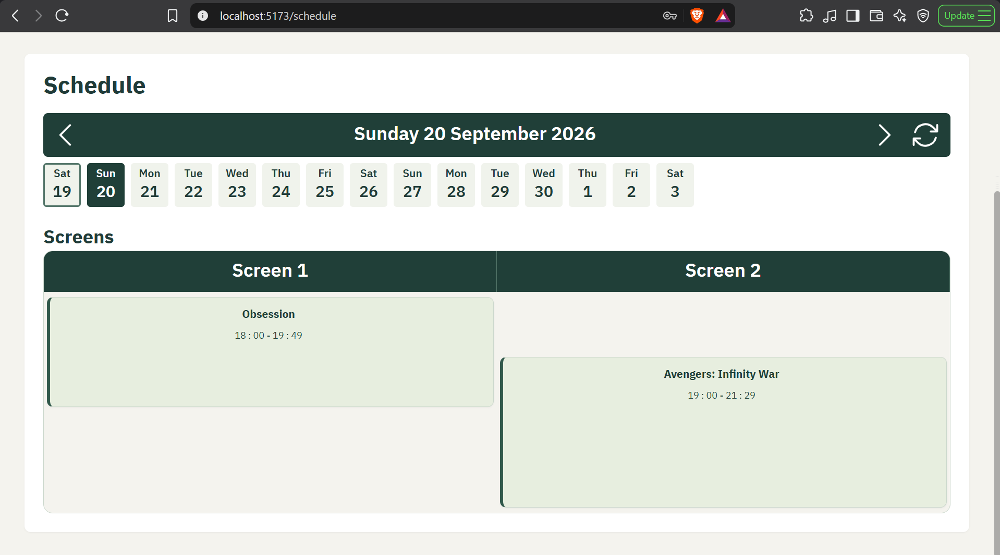
</p>

<h3 align="center">Seat Booking</h3>

<p align="center">
  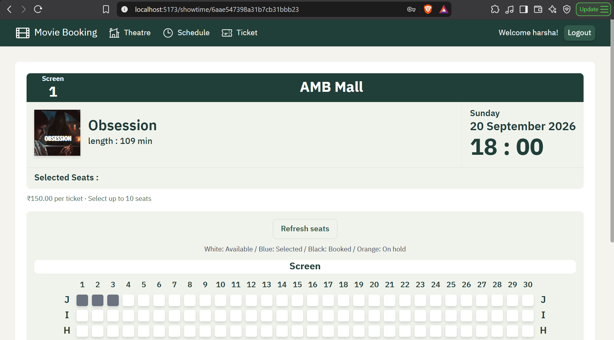
</p>

<p align="center">
  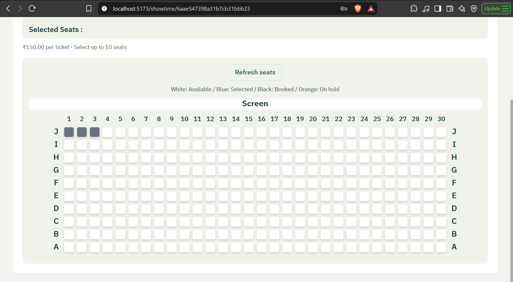
</p>

<h3 align="center">Checkout</h3>

<p align="center">
  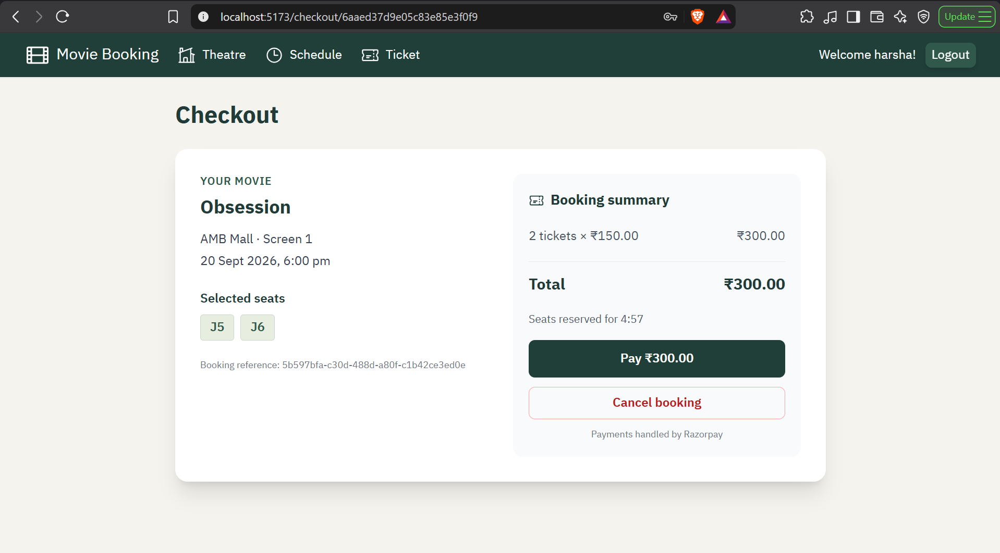
</p>

<h3 align="center">My Tickets</h3>

<p align="center">
  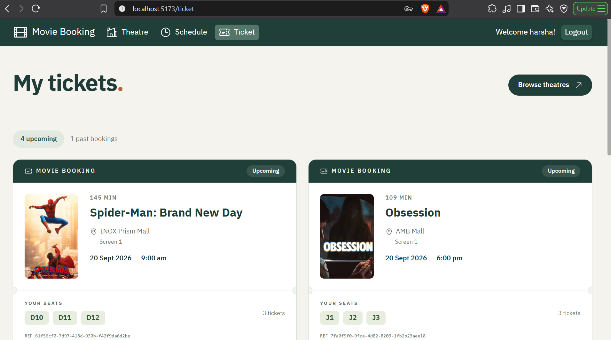
</p>

<h3 align="center">Manage Movies</h3>

<p align="center">
  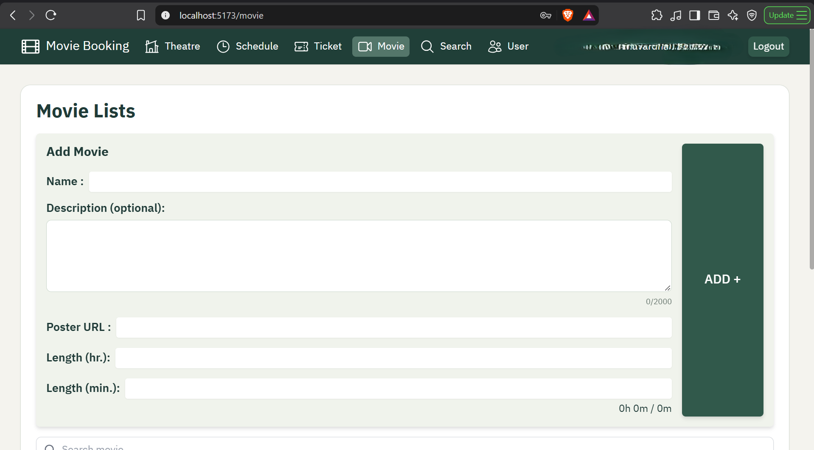
</p>

<p align="center">
  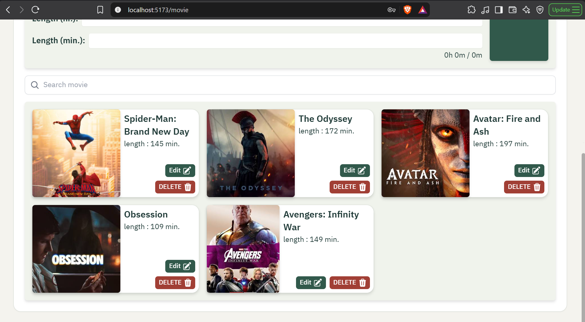
</p>

<h3 align="center">Manage Users</h3>

<p align="center">
  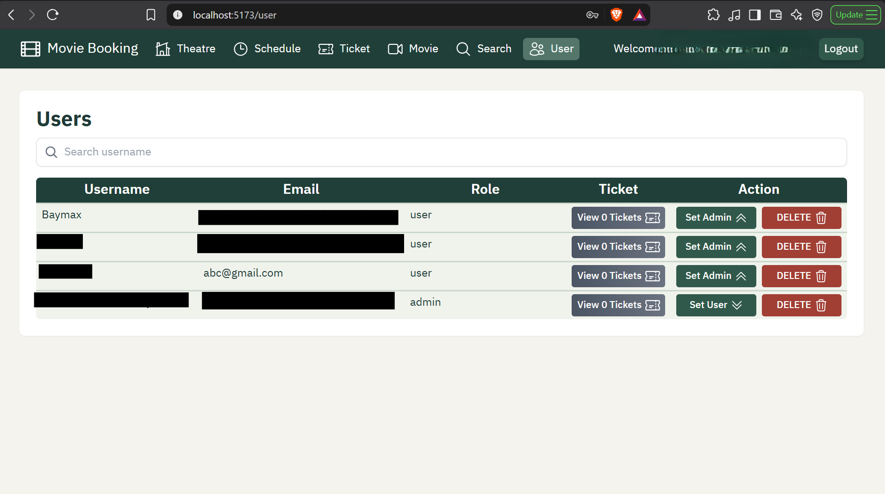
</p>

## Technology

| Area | Tools |
| --- | --- |
| Frontend | React, Vite, React Router, Tailwind CSS, React Hook Form, Axios |
| Backend | Node.js, Express, Mongoose |
| Database | MongoDB Atlas or a local MongoDB replica set |
| Authentication | JWT, bcrypt, Google Identity Services, Google Auth Library |
| Payments | Razorpay Checkout and server-side REST API calls |
| Email | Nodemailer with SMTP |
| Tests | Node.js test runner and MongoDB Memory Server |

## Project structure

```text
client/
  src/
    components/   Shared UI and forms
    context/      Authentication state
    pages/        Application pages
    utils/        Google and Razorpay script loaders
server/
  controllers/    HTTP request handlers
  models/         MongoDB schemas
  routes/         API routes
  services/       Booking, payment, authentication, and email logic
  tests/          Backend tests
  .env.example    Backend configuration template
```

## Local setup

### 1. Prerequisites

- Node.js with npm. The backend uses built-in `fetch` and the Node.js test runner.
- MongoDB Atlas or a configured local replica set. Booking transactions do not work with a standalone MongoDB server.
- Razorpay test credentials for checkout.
- A Google Web client ID for Google sign-in and SMTP credentials for email delivery, if using those features.

### 2. Configure the backend

Copy `server/.env.example` to `server/.env` and replace the placeholders:

```env
DATABASE=your_mongodb_connection_string
PORT=8080
JWT_SECRET=replace_with_a_long_random_secret
JWT_EXPIRE=7d
JWT_COOKIE_EXPIRE=7

RAZORPAY_KEY_ID=rzp_test_your_key
RAZORPAY_KEY_SECRET=your_test_key_secret

GOOGLE_CLIENT_ID=your_web_client_id.apps.googleusercontent.com

SMTP_HOST=smtp.gmail.com
SMTP_PORT=587
SMTP_USER=youraccount@gmail.com
SMTP_PASS=your_app_password
MAIL_FROM="Movie Booking <youraccount@gmail.com>"
```

Keep real credentials out of Git. Configure Atlas database credentials and network access for the machine running the backend.

### 3. Configure the frontend

Create `client/.env`:

```env
VITE_SERVER_URL=http://localhost:8080
VITE_GOOGLE_CLIENT_ID=your_web_client_id.apps.googleusercontent.com
```

The Google client ID must match the backend value. Frontend variables are public: never put SMTP passwords, Razorpay secrets, or a Google client secret here.

### 4. Start the backend

```sh
cd server
npm install
npm start
```

Wait for `mongoose connected!` before using database-backed features. The server listening message alone does not confirm database connectivity.

### 5. Start the frontend

In another terminal:

```sh
cd client
npm install
npm run dev
```

Open the URL printed by Vite, usually `http://localhost:5173`. Restart the relevant development server after changing environment variables.

## First admin and initial data

New password and Google registrations receive the `user` role.

1. Register an account.
2. In your development database's `users` collection, change that account's `role` to `admin`.
3. Log out and log in again.
4. Use the Movies page to add movies, then create a theatre and its screens.
5. Add future showtimes, set ticket prices, and enable **Release now** so customers can book.

An existing admin can assign admin access through the Users page. An admin-email environment allowlist and a separate super-admin role are not implemented.

## Booking and payment flow

1. Selecting seats and proceeding to checkout calls `POST /bookings` with an `Idempotency-Key` header.
2. The backend validates seats and calculates the price from stored showtime data. A transaction creates the booking and its seat hold.
3. Holds last up to five minutes, ending sooner if the show starts first.
4. Checkout creates a Razorpay order through `POST /payments/order`.
5. After payment, `POST /payments/verify` verifies the signature and checks the payment's order, amount, currency, and captured status.
6. A valid payment with a valid reservation confirms the booking. The backend then attempts to send its confirmation email.

Prices are stored as integer paise; administrators enter rupees in the UI.

### Seat availability

| Color | Meaning |
| --- | --- |
| White | Available |
| Blue | Selected |
| Orange | Temporarily held |
| Black | Purchased |

Held and purchased seats cannot be selected. **Refresh seats** fetches current availability; the seat map does not receive live updates.

Expired holds stop blocking seats based on their timestamp. Booking detail/list requests also mark pending records expired and remove expired holds. Booking records are retained; they are not automatically deleted.

**Cancel booking** releases an unconfirmed booking's holds immediately. Confirmed tickets cannot be cancelled through this feature.


## Google sign-in

Configure a Web application OAuth client in Google Cloud and authorize the frontend origin, including its port for local development.

The frontend receives a Google ID token, and `POST /auth/google` verifies it before issuing the application's JWT. This flow uses the client ID, not a client secret.

Google account names are used as usernames, with a numeric suffix when needed. Google-only users do not need a password. If an email already belongs to a password account, Google sign-in does not automatically merge the accounts; the user must use their existing login.

## Confirmation emails

Nodemailer sends booking details to the user's registered email using the configured SMTP account. For Gmail, use an app password from an account with 2-Step Verification enabled, not the normal account password.

Emails contain the movie, theatre, screen, date/time in IST, seats, amount, and booking reference. Checkout displays email status. An email failure does not reverse a confirmed booking.

The backend records sending/sent/failed status to prevent normal duplicate sends. There is no background email retry worker or guaranteed exactly-once delivery; a process interruption during sending may require manual follow-up.

## Checks

Run backend tests from the repository root:

```sh
npm test --prefix server
```

Tests use a temporary local MongoDB replica set and mock external payment, Google verification, and email calls. They do not send real emails or charge payments. MongoDB Memory Server may download its MongoDB binary on the first run.

Build the frontend:

```sh
npm run build --prefix client
```

Preview the build:

```sh
npm run preview --prefix client
```

